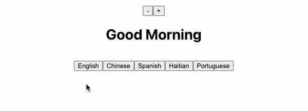

# Multilingual Lab

In this assignment, you will be building out the project shown below. You should divide your UI into the appropriate components and should utilize state and the `useState` hook. 



**Table Of Contents**

- [Short Responses](#short-responses)
- [Tech Checklist](#tech-checklist)
- [Set Up](#set-up)
- [Some Reminders About Proper Coding Style In React](#some-reminders-about-proper-coding-style-in-react)
- [Optional: File Organization Challenge](#optional-file-organization-challenge)
- [Optional: Styling Challenge](#optional-styling-challenge)

## Short Responses

Do them first!

## Tech Checklist

Starting in this unit, we will be using a different form of grading. Rather than running automated tests, we will be testing your application as a user would. We'll run your application and see what features your app can do. Your score will be determined based on the number of completed requirements listed below.

There are 12 tasks to complete and 2 bonuses.

Your goal is to meet at least 75% of these requirements to complete the assignment. But don't stop there! Shoot for 100%! 

**Functionality:**
- [ ] Your app should render as a greeting (perhaps, "Good Morning") in English. 
- [ ] Beneath this greeting, there should be five buttons. 
- [ ] Each button should correspond to a different language (perhaps, "Spanish", "Haitian Creole", and "Portuguese"). 
- [ ] When a language button is clicked, the greeting above should be translated to the appropriate language.
- [ ] Above your greeting, there should be two buttons to change the font size.
- [ ] When the buttons are clicked, the greeting size should grow or shrink accordingly. 

**React Fundamentals**
- [ ] Component names use PascalCase (`MyComponent` instead of `myComponent`)
- [ ] Props are extracted in child components using destructuring
- [ ] `useState` is used to manage state

**Miscellaneous**
- [ ] Used Vite to create the project
- [ ] The size buttons, the greeting, and the language buttons should each be their own component for a total of 3 components (on top of the root `App`)
- [ ] At no point did you ever use any vanilla DOM JS methods (e.g. `document.querySelector` or `document.createElement`)
- [ ] Bonus: You have a `components` directory. Each component has its own file and is exported (1 export per file). The filename matches the name of the component being exported (`Header.jsx` exports a `Header` component).
- [ ] Bonus: Your project has some extra CSS styling!

## Set Up
It's highly recommended you use the scaffolding tool [Vite](https://vitejs.dev/guide/) to create your starter code. You can run these commands to get started:

```sh
# Check your npm version
npm -v 

npm create vite@latest
# Choose Project Name
# Select React
# Select JavaScript

cd project-name
npm i
npm run dev
```

Open up the `App.jsx` file and remove the starter app.

Then get started building!

## Some Reminders About Proper Coding Style In React

```jsx
// useState is imported at the top
import { useState } from 'react';

// component names use PascalCase
const CounterDisplay = ({ count }) => {
  return <p>{count}</p>
}

const CounterButtons = ({ increment, decrement }) => {
  // props are destructured ^          ^
  
  // multiple returned components are wrapped with () and <> </>
  return (
    <>
      <button onClick={increment}>+</button>
      <button onClick={decrement}>-</button>
    </>
  )
}

// App is exported (default or named is fine)
export const App = () => {
  // state is "lifted up" and passed down with props
  const [count, setCount] = useState(0);

  // helper functions can be passed down instead of the setter function itself
  const increment = () => { setCount(count + 1) }
  const decrement = () => { setCount(count - 1) }

  return (
    <>
      <CounterDisplay count={count} />
      <CounterButtons increment={increment} decrement={decrement} />
    </>
  )
}
```

## Optional: File Organization Challenge

Your app should utilize multiple components to organize its content. But maybe you put all of your components in the `App.jsx` file? This is honestly fine for a project of this size but as projects grow (and they will grow), you will need a more organized solution.

Here is what we think works well:
* Create a `components` folder in the `src` folder
* For each component, create a file called `MyComponentName.jsx` (note the capitalized file name. It should match the component that you create)
* The component file should export a single component as the default export.
* In `App.jsx`, import your components! You shouldn't need to update the `App` component itself.

## Optional: Styling Challenge

Ready to add some pizzazz to your website! Add some CSS styling to your website!

Check out this article from FreeCodeCamp on [styling react apps with css](https://www.freecodecamp.org/news/style-react-apps-with-css/).


